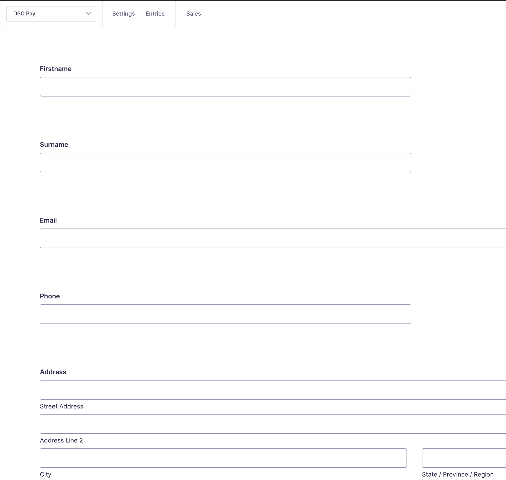
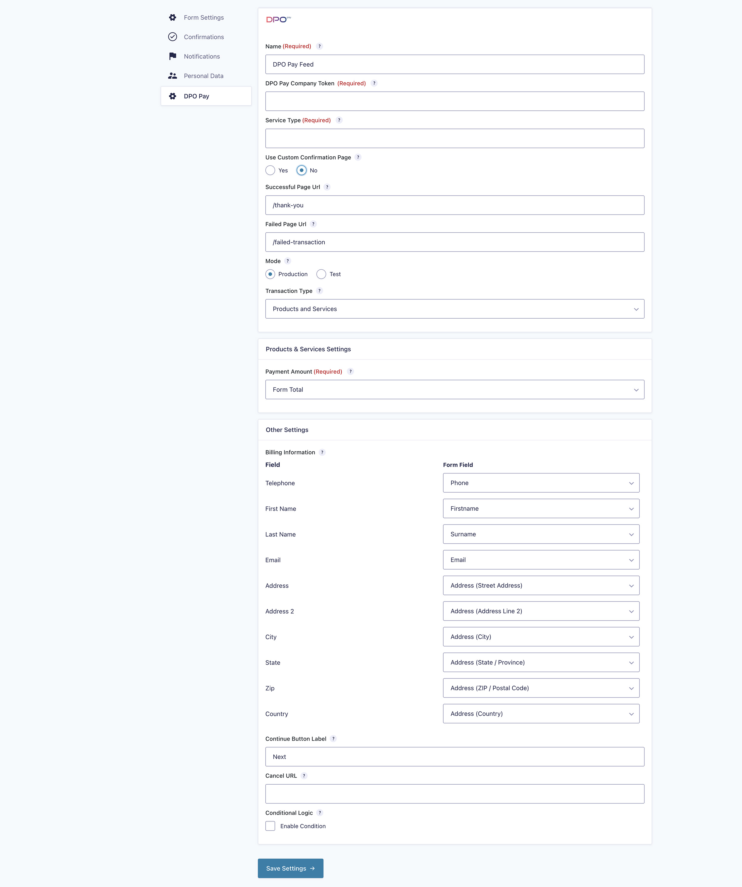
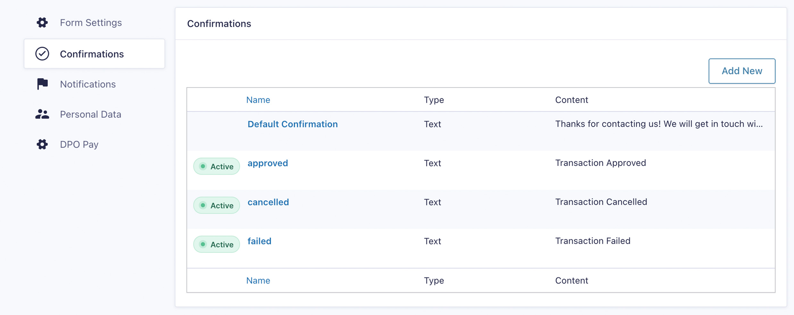

# DPO_Gravity_Forms

## DPO Pay plugin v1.1.0 for Gravity Forms v2.9.1

This is the DPO Pay plugin for WooCommerce. Please feel free to contact
the [DPO Pay support team](https://dpogroup.com/contact-us/) should you require any assistance.

## Installation

1. **Download the Latest Release**
    - Visit the [releases page](https://github.com/DPO-Group/DPO_Gravity_Forms/releases) and
      download [gravity-forms-dpo-group-plugin.zip](https://github.com/DPO-Group/DPO_Gravity_Forms/releases/download/v1.1.0/gravity-forms-dpo-group-plugin.zip).

2. **Install the Plugina**
    - Log in to your WordPress Admin panel.
    - Navigate to **Plugins > Add New > Upload Plugin**.
    - Click **Choose File** and locate the `gravity-forms-dpo-group-plugin.zip` file.
    - Click **Install Now**.
    - Click **Activate Plugin**.

3. **Configure the Plugin**
    - Click on the **Forms** link in your WordPress Admin.
    - Select the form you want to integrate with DPO Pay.
    - Under **Form Settings**, click **DPO Pay**.
    - Under the **DPO Pay Feeds** section, click **Add New** and provide the required data:
        - **Select transaction type**: Choose `Products and Services`. Additional settings will appear.
        - **Map fields**: Match DPO Pay fields with your form fields:
            - Ensure your form includes **Pricing Fields**, **Address Fields**, and an **Email Field**.
            - Map the **DPO Pay country field** to the form's country field.
            - Map the **DPO Pay email field** to the form's email field.
    - Click **Update Settings** or **Save Settings** when done.

> 
> 

4. **Configure Confirmation Messages**
    - Go to the **Confirmations** section.
    - Add three new confirmations with the following names:
        - **Confirmation Name: failed**
        - **Confirmation Name: cancelled**
        - **Confirmation Name: approved**

> 

## Collaboration

Please submit pull requests with any tweaks, features or fixes you would like to share.
